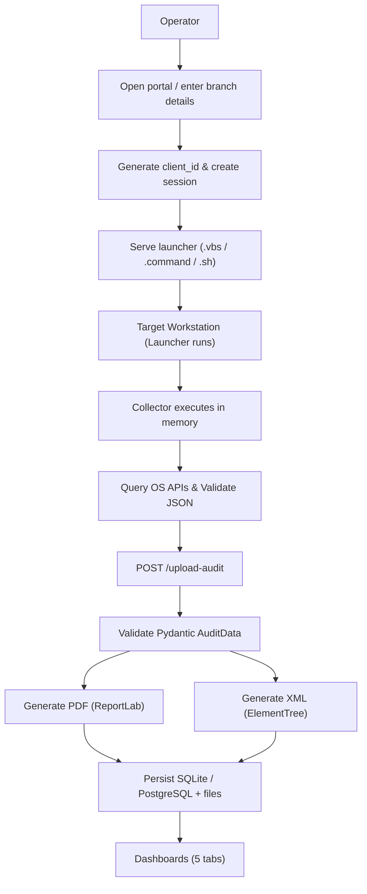
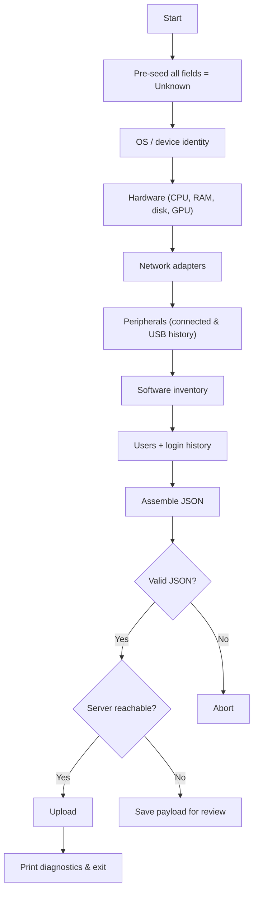
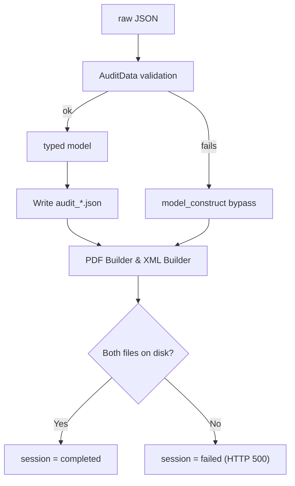
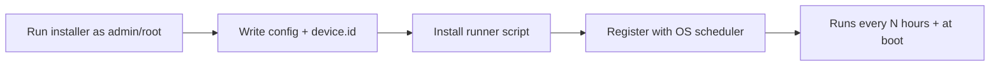
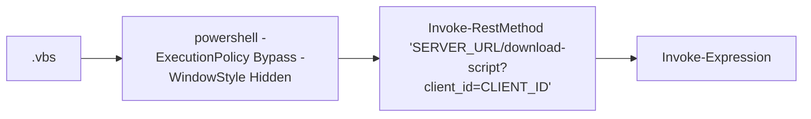

# InfraPulse

**IT Asset Management & Workstation Compliance Audit Platform**  
*Engineered by Prevoyance IT Solutions* — Version 3.0.0

---

## Contents

1. [About the project](#1-about-the-project)
2. [Workflow](#2-workflow)
3. [Technology stack](#3-technology-stack)
4. [OS-level data extraction](#4-os-level-data-extraction)
5. [Functional scope and quality attributes](#5-functional-scope-and-quality-attributes)
6. [Endpoint agent design](#6-endpoint-agent-design)
7. [Related documents](#related-documents)

---

## 1. About the project

InfraPulse collects hardware, software, network and user inventory from Windows, macOS and Linux workstations across branch offices, and turns each collection into a **regulatory compliance report** — a formatted PDF and a schema-conformant XML.

It is built around a single deliverable: **a prescribed audit document**. That distinguishes it from general device-management platforms, which produce live dashboards rather than documents.

### What makes it different

| Feature | Description |
|---|---|
| **Agentless option** | A workstation can be audited once, by running a launcher, with nothing left installed |
| **Scheduled option** | Or an installer registers a recurring audit via Task Scheduler / systemd / launchd |
| **Fixed-format output** | PDF + XML in the exact layout the audit mandate specifies |
| **Asset lifecycle** | Warranty, purchase order, supplier and vendor data that no endpoint agent can read |
| **Zero mandatory infrastructure** | SQLite (WAL mode) / PostgreSQL is optional — the system falls back to file storage and keeps working |

### Scale of the codebase

| Component | File | Lines |
|---|---|---|
| Backend API + report engine | `backend/main.py` | 3,921 |
| Single-page web UI | `frontend/index.html` | 7,682 |
| macOS / Linux collector | `scripts/audit.sh` | 1,352 |
| Windows collector | `scripts/audit.ps1` | 1,111 |
| Service Installers | `scripts/install_service.*` | ~200 |
| **Total** | | **~14,266** |

### Data captured

**67 required fields** across seven groups — Device Data (25), Disk Information (10), Partitions (5), Network Adaptors (12), Peripherals (4), Video Controllers (4), Users (7) — plus full software inventory, hotfix history, login history, antivirus state, and a 17-field asset lifecycle record.

---

## 2. Workflow

### End-to-end flow



### Collector internal sequence



### Report generation



---

## 3. Technology stack

### Backend

| Layer | Technology | Role |
|---|---|---|
| **Web framework** | FastAPI | Async HTTP API, automatic OpenAPI docs |
| **ASGI server** | Uvicorn | Production server |
| **Validation** | Pydantic v2 | `ConfigDict`, `field_validator`, typed payload models |
| **Database** | SQLite3 (WAL Mode) / PostgreSQL | `sqlite3.Row` / `psycopg2-binary`, JSONB columns |
| **PDF generation** | ReportLab | `SimpleDocTemplate`, `Table`, `Paragraph`, `KeepTogether` |
| **XML generation** | `xml.etree.ElementTree` | Standard library |
| **Config** | python-dotenv | `.env` loading |
| **Concurrency** | `concurrent.futures` | Thread pools for network scanning |
| **Remote execution** | `pywinrm`, `pypsexec`, `paramiko`, `smbprotocol` | Optional, lazily imported |

### Frontend

| Layer | Technology | Role |
|---|---|---|
| **Structure** | Single-page HTML5 | No framework |
| **Logic** | Vanilla JavaScript | `fetch`, 2-second polling |
| **Styling** | Hand-written CSS | Custom Glassmorphism design system |

*Deliberately dependency-free — no build step, no `node_modules`, served directly by `StaticFiles`.*

### Endpoint collectors

| Platform | Language | Runtime requirement |
|---|---|---|
| **Windows** | PowerShell 5.1+ | Built into Windows |
| **macOS / Linux** | Bash + embedded Python 3 | Both present by default on target systems |

### Scheduling

| Platform | Mechanism |
|---|---|
| **Windows** | `schtasks` — hourly trigger + `ONSTART` |
| **Linux** | `systemd timer`, `cron` fallback |
| **macOS** | `launchd` LaunchDaemon with `StartInterval` |

---

## 4. OS-level data extraction

How each platform is actually queried. **No kernel drivers, no privileged hooks** — every value comes from a documented operating-system interface.

### 4.1 Windows

| Area | API / library | Notes |
|---|---|---|
| **OS identity** | `Get-CimInstance Win32_OperatingSystem` | Caption, version, architecture, `CSDVersion` for service pack |
| **OS build name** | Registry `HKLM:\SOFTWARE\Microsoft\Windows NT\CurrentVersion` | `DisplayVersion` + `CurrentBuild` + `UBR` → 25H2 (Build 26200.8894). WMI returns only kernel version |
| **Device type** | `Win32_SystemEnclosure.ChassisTypes` | DMI code mapped via switch; falls back to `Win32_ComputerSystem.PCSystemType`; VM detected by model regex |
| **Licence status** | `SoftwareLicensingProduct` | Filtered by Windows `ApplicationID`; `LicenseStatus` 0–6 mapped to names |
| **Hotfixes** | `Get-HotFix` | Caption, HotFixID, description, install date |
| **System identity** | `Win32_ComputerSystem` | Manufacturer, model, domain, domain role, total RAM |
| **CPU** | `Win32_Processor` | Name, core count, processor type |
| **Memory slots** | `Win32_PhysicalMemory` | Per-module capacity, slot count, max supported |
| **BIOS** | `Win32_BIOS` | Version and release date |
| **Physical disks** | `Win32_DiskDrive` | Model, serial, firmware, size, interface |
| **SSD vs HDD** | `MSFT_PhysicalDisk` in `root\Microsoft\Windows\Storage` | **Authoritative** — `MediaType` 3=HDD, 4=SSD, 5=SCM. Model-name regex used only as fallback |
| **Disk → volume link** | `Get-CimAssociatedInstance` | Walks `DiskDrive` → `DiskPartition` → `LogicalDisk` for file system and free space |
| **Partitions** | `Win32_LogicalDisk` | Device ID, file system, size, free space, boot flag |
| **Optical drive** | `Win32_CDROMDrive` | Absence reported explicitly, not assumed |
| **GPU** | `Win32_VideoController` | Name, driver version, `AdapterRAM` for VRAM |
| **Network adapters** | `Win32_NetworkAdapter` + `Win32_NetworkAdapterConfiguration` | MAC, speed, IPv4/IPv6, gateway, DNS, DHCP server, MTU |
| **Primary MAC** | `Get-NetAdapter` | First adapter with `Status -eq "Up"` |
| **Printers** | `Win32_Printer` | Name, system name, BIDI flag, port, extended status |
| **Peripherals / devices** | `Get-PnpDevice`, `Win32_PnPEntity` | Every plug-and-play device across USB, MTP/WPD mobile phones, PCI, Bluetooth, serial, display |
| **Antivirus** | `AntiVirusProduct` in `root\SecurityCenter2` | The only reliable enumeration of third-party AV |
| **Software inventory** | Registry — 3 `Uninstall` hives | `HKLM`, `HKLM\WOW6432Node`, `HKCU`. Omitting `WOW6432Node` hides all 32-bit apps |
| **Software last-used** | `%SystemRoot%\Prefetch\*.pf` | `LastWriteTime` of the prefetch file ≈ last run. Fuzzy name match; falls back to install-dir mtime |
| **User accounts** | `Get-LocalUser` | Name, enabled state, home directory, last logon |
| **Login history** | `Get-WinEvent` — Security log, Event ID 4624 | **Requires Administrator**. Parsed as XML; `LogonType` filtered to 2/7/10/11; machine accounts excluded |
| **Uptime** | `Win32_OperatingSystem.LastBootUpTime` | Converted to seconds + human display |
| **Geolocation** | HTTP → `ip-api.com/json/` | Public IP, city, region, country. The only outbound call |

### 4.2 Linux

| Area | API / library | Notes |
|---|---|---|
| **OS identity** | `/etc/os-release`, `uname -s -r -m` | `NAME`, `VERSION_ID`, `PRETTY_NAME`, kernel release |
| **Hardware identity** | `/sys/class/dmi/id/*` | **SMBIOS via sysfs** — vendor, product name, serial, chassis type, BIOS version/date. Same firmware tables WMI reads |
| **Device type** | `/sys/class/dmi/id/chassis_type` | **Identical numbering to Windows** `ChassisTypes` — the switch table is shared |
| **Container detection** | `/.dockerenv`, `/proc/1/cgroup` | Matches `docker|lxc|kubepods` |
| **VM detection** | `systemd-detect-virt` | Reports the specific hypervisor |
| **CPU** | `/proc/cpuinfo`, `lscpu` | Model name, core and socket counts |
| **Memory** | `/proc/meminfo`, `dmidecode` | Total memory; DMI for slot count and max capacity |
| **Uptime** | `/proc/uptime` | Seconds since boot |
| **Block devices** | `/sys/block/*` | `sr[0-9]*` entries are optical drives |
| **SSD vs HDD** | `/sys/block/*/queue/rotational` | **Kernel's own flag** — 0 = SSD, 1 = HDD. Not an inference |
| **Disks / partitions** | `lsblk`, `df` | Size, mount point, file system, free space |
| **GPU** | `lspci -k` | `-k` reports the kernel driver **actually bound**, not merely installed |
| **USB devices** | `lsusb` | Vendor, product, bus and device number |
| **PCI devices** | `lspci` | Class, vendor, device |
| **Network interfaces** | `ip addr`, `ip link`, `ifconfig` | MAC, IPv4/IPv6, MTU, state |
| **Network connection** | `nmcli -t -f ...` | Active connection, SSID. Terse mode escapes colons as `\:` |
| **Routing / gateway** | `ip route` | Default gateway |
| **DNS** | `/etc/resolv.conf` | Nameservers, search domain |
| **Software inventory** | `dpkg-query -W`, `rpm -qa` | Debian first; `rpm` runs only if `dpkg` returned nothing |
| **Software last-used** | `shutil.which()` + `os.path.getatime()` | Access time of the resolved binary. Unreliable under `noatime`/`relatime` |
| **Users** | `getent passwd`, `/etc/shadow` | Name, home directory, shell, account state |
| **Login history** | `last`, `lastlog` | Login and shutdown records |
| **Printers** | `lpstat`, CUPS | Name, state, queues |

### 4.3 macOS

| Area | API / library | Notes |
|---|---|---|
| **OS identity** | `sw_vers -productVersion`, `-buildVersion` | Product version and build |
| **Hardware model** | `sysctl -n hw.model` | Model identifier, e.g. `MacBookPro18,3` |
| **Device type** | `hw.model` string match | `*Book*` → Laptop, `*iMac*` → All-in-One, `*mini*` → Desktop |
| **CPU / RAM** | `sysctl -n hw.ncpu`, `hw.memsize` | Core count, physical memory bytes |
| **System identity** | `system_profiler SPHardwareDataType` | Serial number, model name, chip, memory |
| **Software inventory** | `system_profiler SPApplicationsDataType -json` | **Native JSON output** — parsed directly, no text scraping |
| **Software last-used** | `os.path.getatime()` on the `.app` bundle | Falls back to `lastModified` from `system_profiler` |
| **GPU** | `system_profiler SPDisplaysDataType` | Chipset, VRAM, resolution |
| **Storage** | `system_profiler SPStorageDataType`, `diskutil` | Volumes, size, free space, file system |
| **USB devices** | `system_profiler SPUSBDataType` | Device tree with vendor and product |
| **Optical drive** | `system_profiler SPDiscBurningDataType`, `drutil status` | Two sources tried in order |
| **Device tree** | `ioreg` | IORegistry for low-level device data |
| **Network interfaces** | `ifconfig`, `networksetup` | MAC, addresses, hardware ports |
| **Wi-Fi / IP** | `ipconfig getifaddr en0` then `en1` | Adapter name varies by model |
| **Users** | `dscl . -list /Users`, `dscacheutil` | Directory Services |
| **Login history** | `last` | Login and reboot history |
| **Printers** | `lpstat -p`, CUPS | CUPS printer state |

### 4.4 Extraction design notes

* **Why `system_profiler -json` matters**: macOS is the only platform with a native structured inventory. Its collectors hand output straight to `json.loads()`, making the macOS branches consistently shorter and less fragile than the Linux equivalents, which parse text.
* **Why Linux and Windows share a chassis table**: Both ultimately read the same SMBIOS/DMI tables published by system firmware — Windows through `Win32_SystemEnclosure`, Linux through `/sys/class/dmi/id/`. The numeric codes are identical, so one switch statement serves both.
* **Authoritative source before heuristic**: Wherever the OS knows an answer, that source is queried first and inference is the fallback — `MSFT_PhysicalDisk.MediaType` and `queue/rotational` over model-name matching; `ChassisTypes` over guessing; Security event log over `LastLogon`.

---

## 5. Functional scope and quality attributes

### 5.1 Functional scope

| # | Capability | Description | Status |
|---|---|---|---|
| F1 | **Compliance audit** | Launcher distribution, collection, PDF + XML generation, status polling, download | Complete |
| F2 | **Asset registry** | CRUD over 17 lifecycle fields — owner, warranty, PO, supplier, vendor, status | Complete |
| F3 | **Device audits** | Per-device hardware specs, software inventory, incremental change tagging | Complete |
| F4 | **Change reporting** | Diff of the two most recent audits — hardware deltas, installed/removed software | Complete |
| F5 | **Network discovery** | TCP port scan over a CIDR, ARP fallback, SNMP check (Port 161), four-source name enrichment | Complete — LAN bound |
| F6 | **Wi-Fi dashboard** | Scan networks, connect, RSSI distance estimation, enumerate subnet devices | Windows-centric |
| F7 | **Scheduled re-audit** | Recurring collection via native OS schedulers | Complete |
| F8 | **Remote audit trigger** | WinRM / PsExec / SSH initiation | Partial — stub |
| F9 | **Authentication** | — | Not implemented |
| F10 | **Vulnerability management** | — | Not in scope |

### 5.2 Quality attributes

| Attribute | Design approach | Current state |
|---|---|---|
| **Reliability** | Pre-seeded fallbacks + `try/except` on every collector; a failed field never aborts the audit. PDF and XML generated independently | **Strong.** The collector cannot crash on a collection failure |
| **Data integrity** | Five validation layers: pre-seed → normalise → authoritative source → structural JSON validation → server-side Pydantic | **Strong on structure.** No cross-source reconciliation or attestation |
| **Availability** | SQLite3 (WAL Mode) / PostgreSQL optional with a complete file-storage fallback; DB outage degrades rather than fails | **Strong** |
| **Portability** | Three collectors covering Windows, macOS, Linux; shared DMI code table; tool-availability guards before every external command | **Strong** |
| **Usability** | Single-page UI, no build step; double-click launchers; self-elevating installers; four numbered diagnostics on connection failure | **Strong** |
| **Performance** | Wide thread pools (up to 512 workers) for scanning; reverse DNS capped at 3s; /24 scan completes in seconds | **Good** for LAN scale |
| **Scalability** | — | **Weak.** In-memory `sessions` dict forces `--workers 1`; `audit_results` grows unbounded; fallback paths do O(n) directory scans. Practical ceiling ~200–500 hosts |
| **Security** | — | **Weak.** No authentication on any endpoint; HTTP by default; Wi-Fi passwords stored in plaintext; `curl \| bash` install channel |
| **Maintainability** | Section-banner organisation; extensive bug post-mortem comments | **Mixed.** ~14,266 lines with duplicated endpoints and repeated report-table blocks |
| **Observability** | Dual logging to file and stdout; per-step console output during collection | **Adequate.** 19 of 54 exception handlers are silent `pass` |
| **Extensibility** | `extra="allow"` on every Pydantic model — new fields accepted without schema changes or breaking installed agents | **Strong** |
| **Auditability** | Every audit persisted as raw JSON alongside the generated PDF and XML | **Strong** for retention, **weak** for provenance |

### 5.3 Known constraints

1. **F5 and F6 require the server on the target LAN** — they inspect the network the server is attached to, which blocks central cloud deployment of those two features.
2. **Software inventory is truncated to 150 entries on macOS and Linux**; Windows is uncapped.
3. **Login history requires Administrator** on Windows; otherwise a weaker fallback is used silently.
4. **"Unknown" is ambiguous** — it means both "absent" and "collection failed".

---

## 6. Endpoint agent design

InfraPulse supports **two deployment modes** from the same collector code.

### Mode 1 — One-shot


### Mode 2 — Scheduled



### 6.1 Launcher artefacts

| Platform | Artefact | Served by | Mechanism |
|---|---|---|---|
| **Windows** | `verify_system_<id>.vbs` / `.exe` | `/download-vbs` / `/download-exe` | `WScript.Shell` / C# wrapper runs PowerShell hidden: `Invoke-RestMethod ... \| Invoke-Expression` |
| **macOS** | `verify_system_<id>.command` | `/download-mac` | `curl -s "..." \| bash` — `.command` is double-clickable in Finder |
| **Linux** | `verify_system_<id>.sh` | `/download-linux` | `curl -s "..." \| bash` |

There is no pre-built standalone `.exe` required (though C# compiled launcher is supported). The Windows path uses a `.vbs` wrapper — chosen because double-clicking it runs PowerShell with no visible console window (`objShell.Run command, 0, False`). The installer entry point is `Install-Audit.bat`, which self-elevates:

```cmd
net session >nul 2>&1
if %errorlevel%==0 goto RUN
powershell -NoProfile -Command "Start-Process -FilePath '%~f0' -Verb RunAs"
```

### 6.2 Key design property — the collector never touches disk

In one-shot mode the collector is fetched and executed entirely in memory:



The server substitutes `base_url` and `CLIENT_ID_PLACEHOLDER` into the script text at serve time, so the collector always calls back on the host the client actually used. Nothing is written to the workstation, nothing needs uninstalling.

### 6.3 Scheduled mode

The installers (`scripts/install_service.*`) read a shared configuration:

| Setting | Purpose |
|---|---|
| `SERVER_URL` | Server address — must be the network IP or Cloudflare tunnel, not localhost |
| `INTERVAL_HOURS` | Audit frequency |
| `INTERVAL_MINUTES` | Testing override |
| `JITTER_SECONDS` | Random pre-run delay so a branch does not hit the server simultaneously |

Each installer:
1. **Verifies elevation** — Administrator / root / sudo, and refuses otherwise
2. **Checks prerequisites** — curl, python3 / PowerShell
3. **Tests reachability** — `curl -s -f -m 10 "$SERVER_URL/api/devices"`
4. **Generates a stable `device.id`** — reused across runs so audits correlate to one machine
5. **Writes a small runner script** — deliberately minimal; it only fetches and executes the current collector, so server-side collector updates apply without revisiting the PC
6. **Registers the schedule**

| Platform | Registration | Boot trigger |
|---|---|---|
| **Windows** | `schtasks /SC HOURLY /MO <n> /RU SYSTEM /RL HIGHEST` | `/SC ONSTART /DELAY 0005:00` |
| **Linux** | `systemd timer`, `cron` fallback to `/etc/cron.d/` | `@reboot sleep 300` |
| **macOS** | `LaunchDaemon .plist` with `StartInterval` | `RunAtLoad` |

Jitter is applied before each scheduled run:
```bash
WAIT=$(( $(od -An -N2 -tu2 < /dev/urandom | tr -d ' ') % JITTER ))
sleep "$WAIT"
```
Without it, every PC in a branch uploads at the same second after a power restoration.

### 6.4 Agent execution contract

| Property | Behaviour |
|---|---|
| **Privileges** | Elevation required to *install* a schedule. One-shot mode runs unelevated, but login history then falls back to a weaker source |
| **Failure mode** | Degrade, never abort — a failed collector yields `"Unknown"` for its fields only |
| **Pre-upload validation** | `audit.sh` validates each JSON fragment and the whole payload; refuses to upload if invalid and saves it to `/tmp/audit_payload_invalid.json`. `audit.ps1` relies on `ConvertTo-Json -Depth 8` |
| **Connectivity check** | `audit.sh` tests TCP reachability via `nc` or bash `/dev/tcp` before uploading, printing four numbered diagnostics on failure |
| **Upload** | `audit.sh`: `curl` (60s cap) → `wget` fallback. `audit.ps1`: `Invoke-RestMethod` (300s) → `System.Net.WebClient` fallback |
| **Idempotency** | Every run produces a new audit record; the backend computes diffs against the previous one |
| **Uninstall** | `uninstall-audit.{ps1,sh,command}` removes the schedule, runner and config |

### 6.5 Known agent-side gaps

1. **No TLS 1.2 enforcement in older `audit.ps1`**. Windows PowerShell 5.1 defaults to TLS 1.0 on some legacy builds.
2. `curl | bash` and `Invoke-RestMethod | Invoke-Expression` are the install channel — acceptable on a trusted LAN, a remote-code-execution path on a public URL.
3. **No payload signing or machine attestation** — `computer_name` is self-reported and `client_id` is a query-string parameter.
4. `audit.ps1` performs no pre-upload validation, unlike `audit.sh`.

---

## Related documents

| Document | Contents |
|---|---|
| `CODEBASE_EXPLANATION.md` | Line-by-line walkthrough of the backend, both collectors, and the verification design |
| `tools-comp.md` | InfraPulse vs osquery + Fleet — cost, security, scale, maintenance |
| `data-fields-comparison.md` | All 67 required fields mapped to the osquery schema; hybrid migration plan |
| `WORKFLOW.md` | Operational workflow |
| `README.md` | Setup, running, and architecture specification document |
